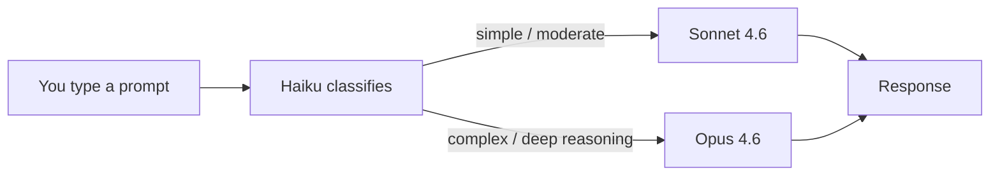

# pi-auto-router

A [pi](https://github.com/badlogic/pi-mono) extension that automatically routes prompts to the right model.

You type a prompt. Haiku classifies it (~300ms, fractions of a cent). The request goes to Sonnet or Opus. Simple tasks stay cheap. Complex tasks get the power they need. You never think about model selection.



## Install

```bash
pi install npm:pi-auto-router
```

Or try it without installing:

```bash
pi -e npm:pi-auto-router
```

## How it works

The extension hooks into `before_agent_start`. Before each LLM call:

1. Sends your prompt to Haiku with a classification instruction
2. Haiku responds with one word: `sonnet` or `opus`
3. Extension calls `pi.setModel()` to switch
4. Status bar shows `→ sonnet` or `→ opus`

**Manual override:** Switch models with `Ctrl+P` or `Ctrl+L` and the router respects your choice for that turn, then resumes auto-routing.

## Routing rules

Haiku routes to **Opus** for:
- Complex architecture and system design
- Multi-file refactors with tricky interdependencies
- Subtle debugging (race conditions, memory leaks, flaky tests)
- Novel algorithm design
- Nuanced writing or deep analysis
- Long chains of reasoning

Everything else goes to **Sonnet**: file reads, lookups, commands, standard edits, straightforward questions, writing tests.

When in doubt, Haiku picks Sonnet. Opus is only for tasks that genuinely need deeper reasoning.

## Cost

The Haiku classification call adds ~$0.0001 per prompt. Over a full day of coding, maybe $0.01-0.05 extra. The savings from not running Opus on simple tasks far outweigh this.

## Configuration

The extension uses these model IDs by default:

| Role | Model ID |
|------|----------|
| Router (classifier) | `claude-haiku-4-5` |
| Standard target | `claude-sonnet-4-6` |
| Complex target | `claude-opus-4-6` |

To change these, edit the constants at the top of `extensions/model-tier-coach.ts`.

## License

MIT
